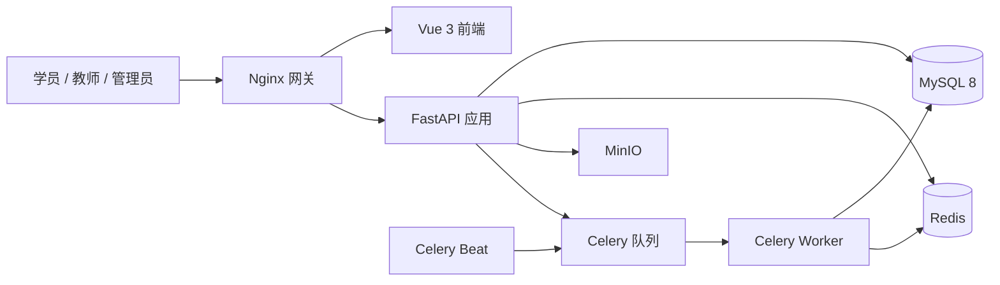
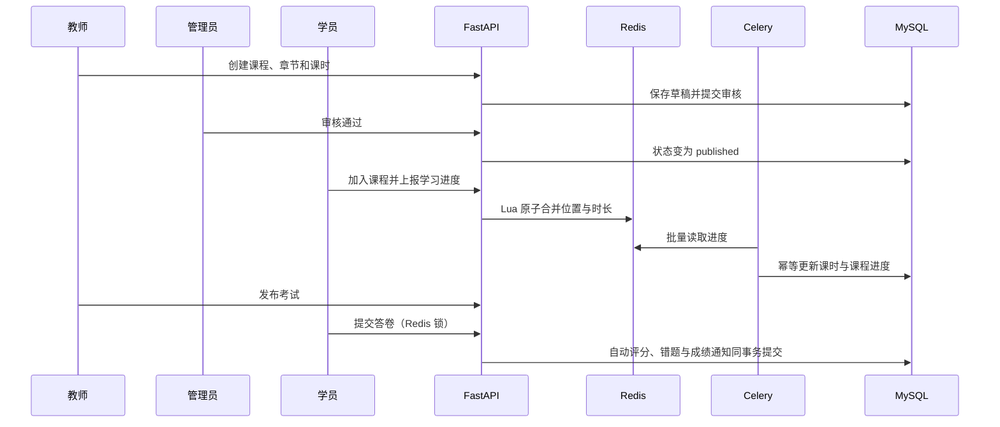

# 系统架构

## 总体设计

EduFlow 第一版采用模块化单体。业务在一个 FastAPI 应用内按 API、Schema、Service、Repository、Model 分层，复杂度低于微服务，同时保留清晰的模块边界，适合独立部署、测试和后续拆分。

## 后端分层

| 分层 | 职责 | 目录 |
|---|---|---|
| API | 路由、依赖注入、权限声明、HTTP 响应 | `backend/app/api` |
| Schema | 入参与出参校验、序列化 | `backend/app/schemas` |
| Service | 状态机、事务、幂等和资源归属等业务规则 | `backend/app/services` |
| Repository | 可复用查询和持久化访问 | `backend/app/repositories` |
| Model | SQLAlchemy 实体、关系、索引和唯一约束 | `backend/app/models` |
| Task | Celery 异步与定时任务 | `backend/app/tasks` |

统一异常由 `AppException` 体系转换为稳定错误码，`RequestContextMiddleware` 为每次请求生成或透传 `request_id`，便于把响应和结构化日志关联起来。

## 核心业务链路

## 关键设计取舍

### JWT 双令牌

Access Token 生命周期短，用于接口访问；Refresh Token 只保存哈希和 JTI，刷新时轮换旧令牌。退出和修改密码会撤销会话，降低令牌泄漏影响。

### 学习进度最终一致性

高频播放进度不直接逐次写 MySQL。Redis Lua 按客户端时间拒绝旧事件，播放位置只前进、学习时长只累加；Celery 每分钟批量落库。数据库唯一约束保证同一用户同一课时仅一条进度记录。代价是短时间内缓存与数据库可能不一致，因此读取最近位置优先查 Redis。

### 考试幂等

提交接口使用 Redis `SET NX EX` 锁限制并发，再以 `(exam_id, user_id)`、`idempotency_key` 和答题唯一约束守住数据库边界。重复提交已评分答卷直接返回原结果。

### 数据权限

RBAC 解决“能否调用接口”，资源归属解决“能否操作这条数据”。例如教师具备 `course:update` 后，Service 仍校验课程 `teacher_id`，避免横向越权。

### 文件直传

客户端先申请 MinIO 预签名 URL，再直接上传对象，最后调用完成接口验证对象存在、大小和用途。应用服务器不转发大文件，减少带宽和内存压力。

## 可观测性与故障边界

- 请求日志包含方法、路径、状态码、耗时和 `request_id`。
- FastAPI、Worker、Beat 分开运行，异步任务失败不阻塞普通请求。
- MySQL、Redis、MinIO 和后端均配置容器健康检查。
- Nginx 统一提供 `/api`、`/docs` 和前端静态页面入口。
- 第一版尚未接入 Prometheus、OpenTelemetry 和集中日志平台，见面试文档中的增强路线。
