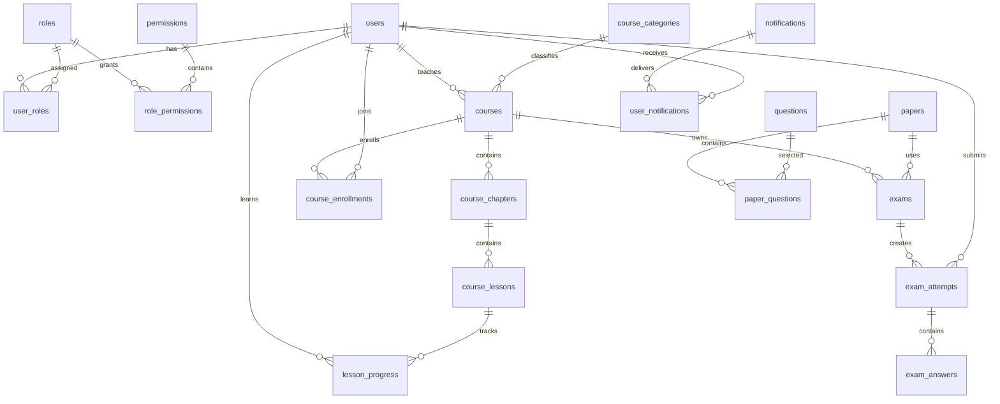

# 数据库设计

## 数据模型概览

生产环境使用 MySQL 8，测试环境使用 SQLite。所有主键使用大整数模型并为 SQLite 提供整数变体；业务时间使用 UTC 保存，展示层按时区转换。



## 表分组

| 领域 | 表 |
|---|---|
| 用户权限 | `users`、`refresh_tokens`、`login_logs`、`roles`、`permissions`、`user_roles`、`role_permissions`、`operation_logs` |
| 课程 | `course_categories`、`courses`、`course_chapters`、`course_lessons`、`course_audits` |
| 学习 | `course_enrollments`、`course_favorites`、`lesson_progress`、`learning_daily_stats` |
| 考试 | `questions`、`question_options`、`papers`、`paper_questions`、`exams`、`exam_attempts`、`exam_answers`、`wrong_questions` |
| 消息文件 | `notifications`、`user_notifications`、`files` |

## 关键约束

- `users.username`、`users.email` 唯一，删除使用 `deleted_at` 软删除语义。
- `course_enrollments(course_id, user_id)` 唯一，避免重复选课。
- `lesson_progress(user_id, lesson_id)` 唯一，配合 upsert 保证进度幂等。
- `exam_attempts(exam_id, user_id)` 唯一，每名学员每场考试一份答卷。
- `exam_attempts.idempotency_key` 唯一，拒绝跨请求重复写入。
- `exam_answers(attempt_id, question_id)` 唯一，防止同一题生成多条答案。
- `wrong_questions(user_id, question_id)` 唯一，错误次数在原记录上累加。
- `notifications.source_key` 唯一，定时提醒和成绩通知可安全重试。
- 课程按 `(teacher_id, status)`、`(category_id, status)` 建复合索引，匹配教师工作台和公开列表查询。

## 状态机

课程状态：

```text
draft -> pending_review -> published -> offline
                   \-> rejected -> draft（编辑后可再次提交）
```

选课状态为 `active`、`completed`、`withdrawn`；考试答卷为 `in_progress`、`graded`。应用代码统一使用 Python 枚举参与 SQL 查询，避免数据库枚举名称和值混用。

## 迁移管理

```bash
cd backend
.venv/bin/alembic upgrade head
.venv/bin/alembic current
.venv/bin/alembic downgrade -1
```

新增模型字段后先生成迁移，再人工检查字段类型、默认值、索引、外键和降级逻辑：

```bash
.venv/bin/alembic revision --autogenerate -m "add_xxx"
```

生产升级前应备份数据库，并在同版本预发布数据上演练 `upgrade`；不可把 `Base.metadata.create_all()` 当作生产迁移方案。

## 事务边界

- 注册：用户、默认角色和登录相关数据保持一致。
- 课程审核：审核记录与课程状态在同一事务提交。
- 考试评分：答卷、答案、错题、分数和成绩通知同一事务提交。
- 学习落库：按缓存记录逐条 upsert；成功后使用 compare-delete 删除对应 Redis 值，防止删除并发写入的新进度。
